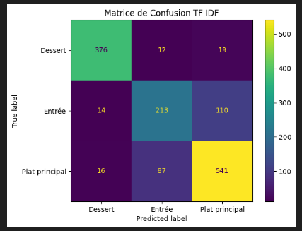

# DEFT2013 Tâche 2 :

CHEBBAH Djamel, TER Léon

## Statistiques corpus

	Nombre d'entrées dans les documents train/test
	- train.csv: 8731 entrées 
	- test.csv: 1388 entrées

	Les champs importants ici sont:
	- titre: nom de la recette
	- type : type de la recette à prédire 'Entree/Plat principal/Dessert' 

	Répartition des types de recettes dans le fichier train:
	- Plat principal : 46%
	- Dessert : 30%
	- Entrée : 24%
## Méthodes proposées

### Run1: baseline (méthode de référence)

	Description de la méthode:
	- Tire aléatoirement parmis les 3 types de recette autant de fois qu'il y a d'entrées dans le fichier de test. 
	- Pas d'utilité à avoir le fichier d'entraînement.

### Run2: TF-IDF

	Description de la méthode:
	- Utilisation de TF_IDF qui emploi la fréquence des mots dans un texte.

### Run3: Word2Vec

	Description de la méthode:
	- Utilisation de Word2Vec avec plongement de mots et de SVM.

### Run4: Modelcamembert
	Description de la méthode:
	- 

## Résultats

| Run      | macro avg f1 Score |
| -------- | --------:|
| baseline |  12,4 |
| TF-IDF   |  80  |
| Word2Vec   |  63.8 (provisoire)| 
| Modelcamembert   |   |

### Analyse de résultats
	
Des méthodes implémentées TF-IDF obtiennent des résultats significativement supérieurs à Word2Vec, qui est la méthode la moins performante.
Regardons plus en détail la méthode avec le meilleur f1_score moyen, TF-IDF:

Il est à remarquer que les desserts sont les recettes les mieux prédites (92%), suivis des plats (82%) et enfin des entrées (66%).
Pour les desserts, il est possible que ce soit des recettes utilisant des expressions/ingrédients complètement différents des plats/entrées, ce qui expliquerait que le modèle n'a prédit que très rarement autre chose que des desserts.
D'autre part, les recettes les plus prédites sont classifiées comme "Plat principal". Cela peut s'expliquer par le grand nombre de "Plat principal" dans les fichiers, expliquant ainsi un plus grand nombre de "Plat principal" prédits. Finalement, la similarité des expressions/ingrédients entre "Entrée" et "Plat principal" pourrait être une raison pour laquelle le modèle prédit autant de fois qu'une recette est un "Plat principal" alors qu'elle devrait être une "Entrée".

Des méthodes employées, Word2Vec est celle qui rend les moins bons résultats. Cela pourrait s'expliquer par la nature même de Word2vec et des word embeddings où il est nécessaire d'avoir des jeux de données conséquents.

En comparant les méthodes, on se rend compte qu'une approche avec TF-IDF, par principe moins complexe que les autres, est tout à fait adéquate pour obtenir des résultats optimaux.
